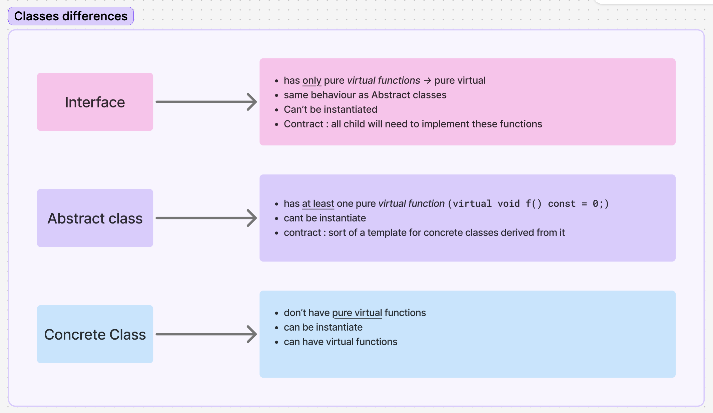
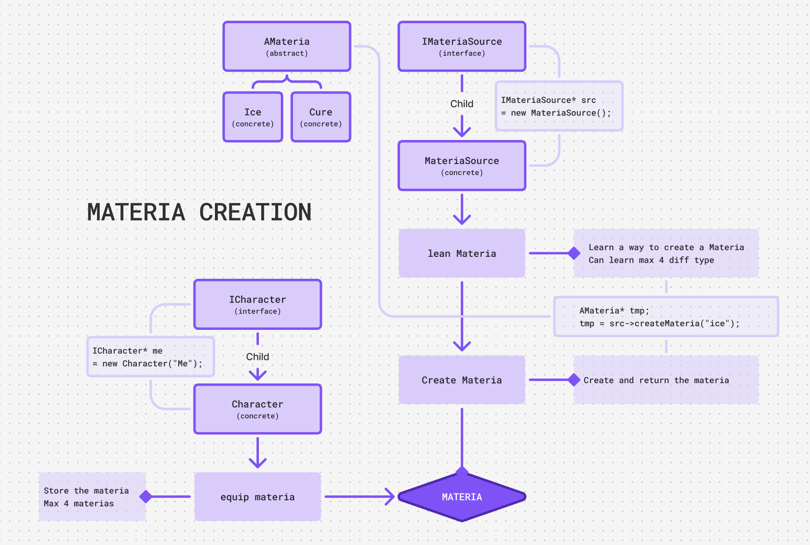
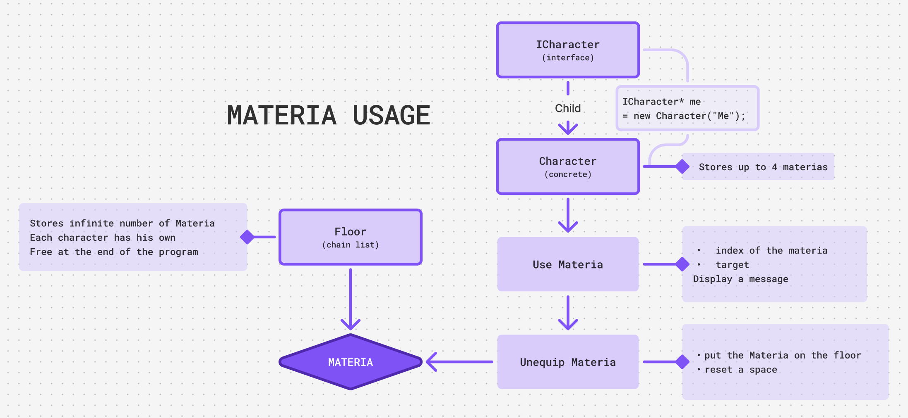

<!-- README.md -->
<h1 align="center">
  CPP04
</h1>

<p align="center">
  <i>C++ module CPP04 – 42 Common Core</i><br>
  <strong>Developed in C++ by <a href="https://github.com/Hyliah">@Hyliah</a></strong>
</p>

<p align="center">
  
  
  
  
</p>

---

<h2>♦ Objective ♦</h2>

The goal of this module is to introduce and practice fundamental C++ concepts, with a strong focus on **object-oriented programming**, strict compilation rules, and clean design.

---

<h2>♦ Concepts Covered ♦</h2>

- Polymorphism  
- Abstract classes  
- Interfaces  
- Virtual destructors

---

<h2>♦ Exercises ♦</h2>

| Exercise | Name | Description |
|--------|-------------|----------|
| ex00 | Polymorphism | Virtual functions and base class behavior |
| ex01 | I don’t want to set the world on fire | Deep copy, dynamic memory and virtual destructors |
| ex02 | Abstract class | Interfaces and pure virtual methods |
| ex03 | Interface & recap | Interface-based design and polymorphic cloning |

---

<h2> ♦ Compilation & Execution ♦</h2>

All projects are compiled using a Makefile compling with flags :
 -Wall -Wextra -Werror -std=c++98

All compilator gives tailored informations
exemple : 

```bash
make
./Polymorphism ready to use.
./Polymorphism
```

---
<h2>♦ Personal Notes ♦</h2>

<p>[Different classes explained]</p>


<p>[ex03 : AMateria visual : AMateria Creation]</p>


<p>[ex03 : AMateria visual : AMateria Usage]</p>


CPP - Homemade HelpCenter : 
<a href="https://www.figma.com/board/YLwrD2ZJmG2QEYdvLQ85o0/CPP_help-center?node-id=0-1&t=rvW7b2dDy1z6ygfJ-1">CPP HelpCenter</a>


---

<h2>♦ Author ♦</h2>

42 login: hlichten
